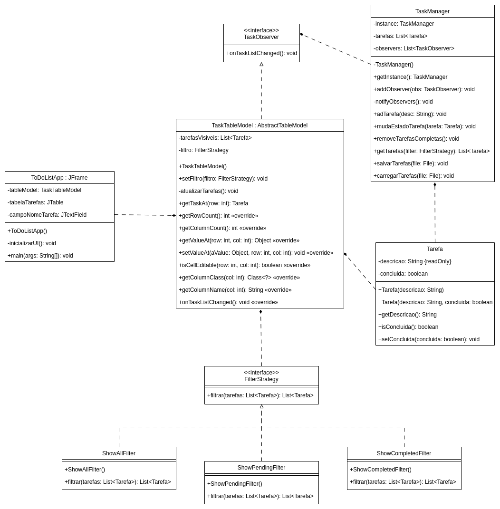

# 📝 ToDoList Java Swing

## 📌 Tema Escolhido

Este projeto é uma aplicação desktop de lista de tarefas (**ToDoList**) construída com **Java Swing**, com foco em aplicar três padrões de projeto clássicos: **Singleton**, **Observer** e **Strategy**.

Funcionalidades:
- Adicionar tarefas
- Marcar como concluída
- Filtrar por todas, pendentes ou concluídas
- Remover tarefas concluídas
- Persistência automática em arquivo (`tarefas.txt`)

---

## 🧱 Arquitetura Geral

Todas as classes estão organizadas no mesmo pacote base: `org.example`.  
A separação lógica ocorre por responsabilidade e nome de classe, com destaque para:

- **UI (Interface Gráfica)**: `ToDoListApp`, `TaskTableModel`
- **Modelo de dados**: `Tarefa`, `TaskManager`
- **Padrão Strategy**: `FilterStrategy`, `ShowAllFilter`, `ShowCompletedFilter`, `ShowPendingFilter`
- **Padrão Observer**: `TaskObserver` (interface), observado por `TaskTableModel`

---

## 🧠 Padrões Aplicados

### 🔁 Singleton — `TaskManager`

- **Como**: `TaskManager` implementa uma instância única acessada via `getInstance()`
- **Por que**: Garante que apenas um controlador gerencia o estado global das tarefas

---

### 👁️ Observer — `TaskManager`, `TaskObserver`, `TaskTableModel`

- **Como**:
  - `TaskObserver` é uma interface
  - `TaskManager` mantém a lista de observadores e notifica quando a lista de tarefas muda
  - `TaskTableModel` implementa `TaskObserver` e atualiza a UI automaticamente
- **Por que**: Permite sincronizar mudanças no modelo com a interface gráfica sem acoplamento direto

---

### 🧩 Strategy — `FilterStrategy` e suas implementações

- **Como**: A interface `FilterStrategy` permite alternar filtros de exibição dinamicamente
- **Implementações**:
  - `ShowAllFilter`
  - `ShowCompletedFilter`
  - `ShowPendingFilter`
- **Por que**: Facilita a manutenção e a inclusão de novas lógicas de filtragem sem alterar a lógica principal

---

## 📊 Diagrama de Classes (UML Simplificado)

---

## 🧾 Considerações Finais

- O projeto foca na clareza e separação de responsabilidades.
- Todos os padrões foram aplicados com justificativas práticas:
  - **Singleton** centraliza o gerenciamento de tarefas
  - **Observer** garante atualização automática da interface
  - **Strategy** desacopla a lógica de filtragem
- O uso do **Java Swing** demonstra como padrões clássicos podem ser aplicados até mesmo em interfaces tradicionais.

---

📁 O arquivo `tarefas.txt` é usado para persistência automática de dados ao iniciar e fechar a aplicação.

---

👨‍💻 Projeto didático com fins de estudo de padrões de projeto em Java.
